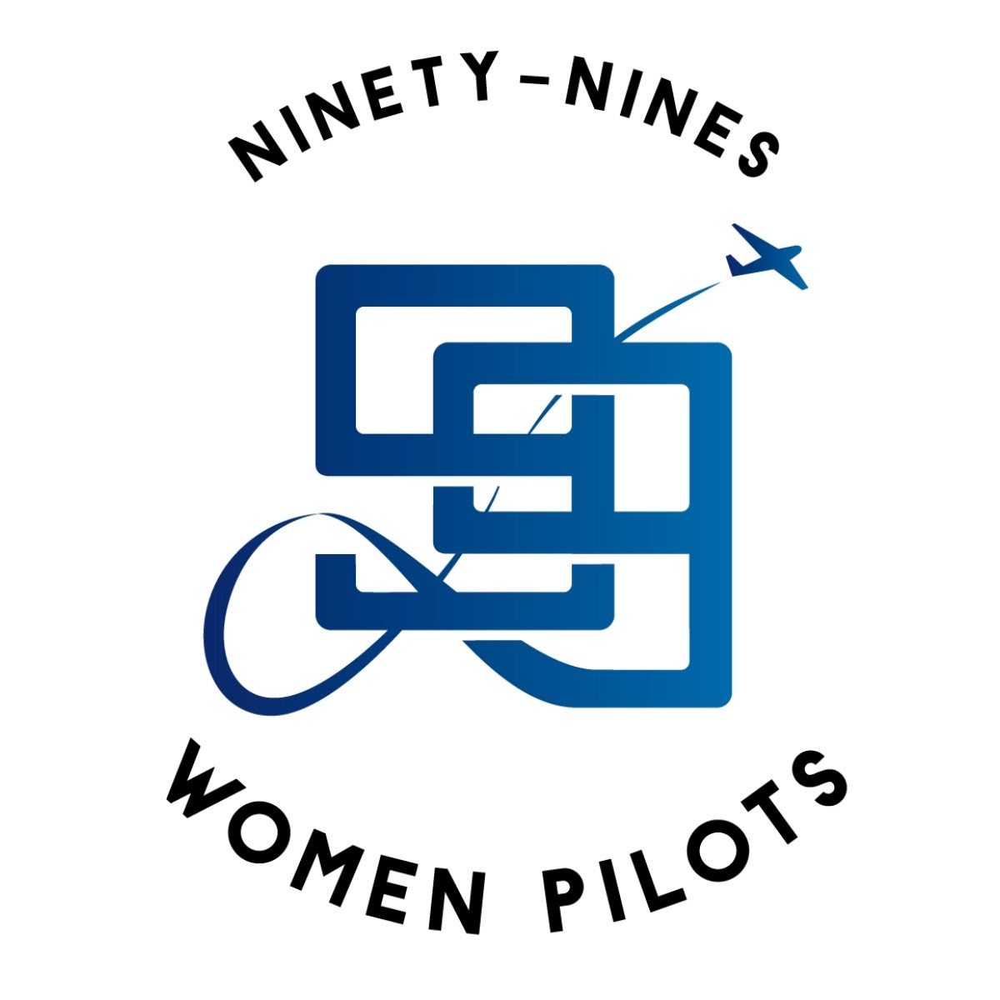

Meredith Holladay has cordially invited CAPA and several related groups to an open house for food, fun, camaraderie and to chat about future plans at KCRG. 

Here at CRG, we have several intermingled groups of pilots, including EAA Chapter 193, the Ninety Nines and the Craig Airport Pilots Association. There are also several flight schools and corporate operators. Private pilot or ATP, aircraft owner or renter, we all have a lot to share with one another.

Meredith would like to invite each of you to an informal get-together on Saturday, June 15 at noon, rain or shine. Holladay Aviation will host the meeting at their hangar at the Craig Air Center. They will provide burgers and hot dogs on the grill, as well as a cooler full of soft drinks. If you plan to attend, please bring a small container of your favorite side dish or dessert to share with the group. Kids and significant others are welcome!

During the event we will have an informal meeting to discuss plans for the next annual Spot Landing Contest at CRG. We will also revisit the Ninety Nines’ plan to repaint the compass rose at CRG.

Looking forward to seeing you all on June 15!  If you missed the last coffee, now is your chance to meet your fellow Craig Pilots and you don’t even have to wake up early.

Please RSVP to Meredith Holladay via email [meredith at holladayaviation.com](mailto:meredith@holladayaviation.com), or call her at (904) 625-4318.

Address:  [855 St Johns Bluff Rd N, Jacksonville, FL 32225](https://goo.gl/maps/UFKLg6TVRSB446zWA)

Directions: Upon entering Craig Airport, take the first left.  The Holladay Hangar is the first one on the left as you enter the Craig Air Center parking lot.

# Calling All Women Pilots! The Men are also invited!

From Meredith Holladay;

"As chair of the First Coast chapter of the Ninety Nines, one of my primary goals is to bring Jacksonville area women pilots into the foreground of our existing aviation community. Here at CRG, we have several intermingled groups of pilots, including EAA Chapter 193 and the Craig Airport Pilots Association. There are also several flight schools and corporate operators. Male or female, private pilot or ATP, aircraft owner or renter, we all have a lot to share with one another."

"I would like to invite each of you to join us for an informal get-together on Saturday, June 15 at noon, rain or shine. My company, Holladay Aviation, will host the meeting at our hangar at the Craig Air Center. We will provide burgers and hot dogs on the grill, as well as a cooler full of soft drinks. If you plan to attend, please bring a small container of your favorite side dish or dessert to share with the group. Kids and significant others are welcome!"

"During the event we will have an informal meeting to discuss plans for the next annual Spot Landing Contest at CRG. We will also revisit our chapter’s plan to repaint the compass rose at CRG."

Please RSVP to Meredith Holladay via [meredith@holladayaviation.com](mailto:meredith@holladayaviation.com), or call her at (904) 625-4318. Thank you and she looks forward to seeing you on June 15!

Meredith Holladay
Manager, Holladay Aviation
[www.holladayaviation.com](https://www.holladayaviation.com)