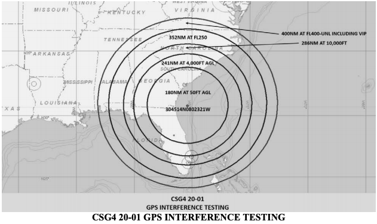

The Navy will be doing some GPS interference testing off the coast from January 16th through January 24th. Here is a link to the [FAA notam](https://www.faasafety.gov/files/notices/2020/Jan/CSG4_20-01_GPS_Flight_Advisory.pdf).

GPS testing is scheduled as follows and may result in unreliable or unavailable GPS signal.

A. Location: Centered at 304514N0802321W or the CRG VOR 074 degree radial at 63NM.

B. Dates and times (Dates and times are based on GMT (Z).):
16 JAN 20 1200Z – 2100Z
17 JAN 20 1330Z – 1700Z
18 JAN 20 1700Z – 2359Z
23 JAN 20 1200Z – 2359Z
24 JAN 20 1130Z – 2359Z

C. Duration: Each event may last the entire requested period.

D. NOTAM INFO: NAV GPS (CSG4 GPS 20-01) (INCLUDING WAAS, GBAS, AND
ADS-B) MAY NOT BE AVBL WI A 400NM RADIUS CENTERED AT
304514N0802321W (CRG074063) FL400-UNL,
352NM RADIUS AT FL250,
286NM RADIUS AT 10000FT,
241NM RADIUS AT 4000FT AGL,
180NM RADIUS AT 50FT AGL.

E. Pilots are encouraged to report anomalies in accordance with the Aeronautical
Information Manual (AIM) paragraphs 1-1-13 and 5-3-3.
