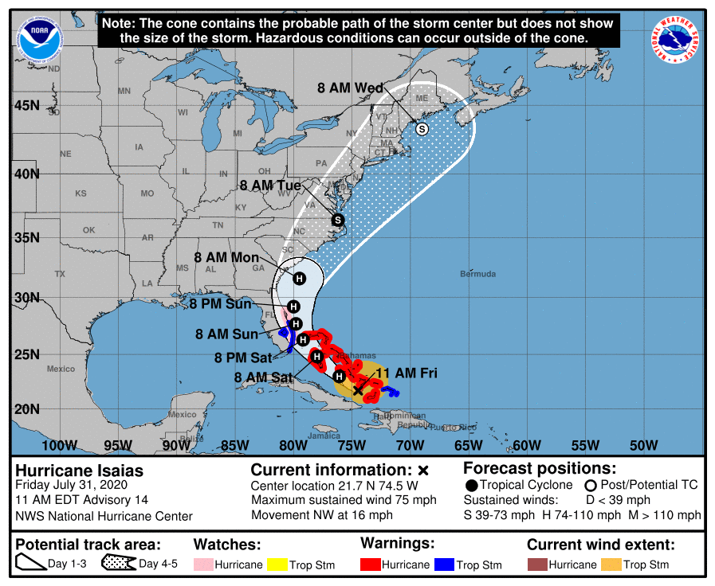

Hello All,

I have had a few request to store aircraft in the 607 hangar.  I will start letting those place their aircraft in the hangar starting this morning at 9am. We will close and lock up the hangar at 3:30pm today and it will not be open until 7am Monday, weather permitting. If you choose to place your aircraft in the hangar an authorize signature is require on a hold harmless prior to placing the aircraft inside. I've attached this hold harmless with this email.  On Monday once the hangar is open, please make sure your aircraft is removed within 24 hours. If you have a question about these conditions, give me a call.

Thanks,

Brad Martin ACE