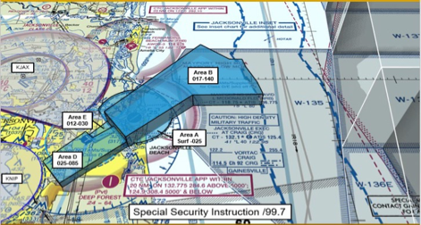

[SSI – Special Security Instruction Airspace (SSI/99.7)](https://tfr.faa.gov/save_pages/detail_1_0382.html)

•	SSI/99.7 airspace will be published in NOTAMS.  
•	Areas E/D will only be active during an arrival to RWY05 at NRB.

FDC 1/0382 ZJX PART 1 OF 4 FL..AIRSPACE MAYPORT, FL..TEMPORARY FLIGHT RESTRICTIONS. DECEMBER 15, 2021 LOCAL. PURSUANT TO 49 USC 40103(B)(3), THE FEDERAL AVIATION ADMINISTRATION (FAA) CLASSIFIES THE AIRSPACE DEFINED IN THIS NOTAM AS 'NTL DEFENSE AIRSPACE'. PILOTS WHO DO NOT ADHERE TO THE FOLLOWING PROC MAY BE INTERCEPTED, DETAINED AND INTERVIEWED BY LAW ENFORCEMENT/SECURITY PERSONNEL. ANY OF THE FOLLOWING ADDITIONAL ACTIONS MAY ALSO BE TAKEN AGAINST A PILOT WHO DOES NOT COMPLY WITH THE RQMNTS OR ANY SPECIAL INSTRUCTIONS OR PROC ANNOUNCED IN THIS NOTAM: A) THE FAA MAY TAKE ADMINISTRATIVE ACTION, INCLUDING IMPOSING CIVIL PENALTIES AND THE SUSPENSION OR REVOCATION OF AIRMEN CERTIFICATES; OR B) THE UNITED STATES GOVERNMENT MAY PURSUE CRIMINAL CHARGES, INCLUDING CHARGES UNDER TITLE 49 OF THE UNITED STATES CODE, SECTION 40103(B)(3); OR C) THE UNITED STATES GOVERNMENT MAY USE DEADLY FORCE AGAINST THE AIRBORNE ACFT, IF IT IS DETERMINED THAT THE ACFT POSES AN IMMINENT SECURITY THREAT. PURSUANT TO TITLE 14 CFR SECTION 99.7, SPECIAL SECURITY 2112151200-2112151600 END PART 1 OF 4 FDC 1/0382 ZJX PART 2 OF 4 FL..AIRSPACE MAYPORT, FL..TEMPORARY FLIGHT INSTRUCTIONS, ALL ACFT FLT OPS ARE PROHIBITED WI AN AREA DEFINED AS 301918N0812606W (CRG108004) THEN COUNTERCLOCKWISE ON A 4.2 NM ARC CENTERED ON 302329N0812528W (CRG058005.4) TO 302421N0813013W (CRG008004) TO THE POINT OF ORIGIN SFC-2500FT MSL EFFECTIVE 2112151200 UTC (0700 LOCAL 12/15/21) UNTIL 2112151600 UTC (1100 LOCAL 12/15/21). WI AN AREA DEFINED AS 301853N0812530W TO 302232N0812838W TO 303421N0811707W TO 303129N0811308W TO 303128N0811123W TO 303000N0811057W TO 302721N0810938W TO 302518N0810901W TO 302509N0811756W TO THE POINT OF ORIGIN 1700FT MSL-14000FT MSL EFFECTIVE 2112151200 UTC (0700 LOCAL 12/15/21) UNTIL 2112151600 UTC (1100 LOCAL 12/15/21). WI AN AREA DEFINED AS 301853N0812530W (CRG111004.6) TO 301332N0813207W (CRG194006.9) TO 301614N0813442W (CRG224005.4) TO 302017N0813041W TO 301924N0812939W (CRG142001.2) TO 302105N0812723W (CRG078002.9) TO THE POINT OF ORIGIN 2500FT MSL-8500FT MSL 2112151200-2112151600 END PART 2 OF 4 FDC 1/0382 ZJX PART 3 OF 4 FL..AIRSPACE MAYPORT, FL..TEMPORARY FLIGHT EFFECTIVE 2112151200 UTC (0700 LOCAL 12/15/21) UNTIL 2112151600 UTC (1100 LOCAL 12/15/21). WI AN AREA DEFINED AS 301924N0812939W (CRG142001.2) TO 302017N0813041W TO 302232N0812838W (CRG041002.8) TO 302105N0812723W (CRG078002.9) TO THE POINT OF ORIGIN 1200FT MSL-3000FT MSL EFFECTIVE 2112151200 UTC (0700 LOCAL 12/15/21) UNTIL 2112151600 UTC (1100 LOCAL 12/15/21). EXCEPT AS SPECIFIED BELOW AND/OR UNLESS AUTHORIZED BY ATC: 1. ALL AIRCRAFT ENTERING OR EXITING THE TFR MUST BE ON A DISCRETE CODE ASSIGNED BY AN AIR TRAFFIC CONTROL (ATC) FACILITY. 2. AIRCRAFT MUST BE SQUAWKING THE DISCRETE CODE AT ALL TIMES WHILE IN THE TFR. 3. ALL AIRCRAFT ENTERING OR EXITING THE TFR MUST 2112151200-2112151600 END PART 3 OF 4 FDC 1/0382 ZJX PART 4 OF 4 FL..AIRSPACE MAYPORT, FL..TEMPORARY FLIGHT REMAIN IN TWO-WAY RADIO COMMUNICATIONS WITH ATC. 4. MAYPORT ATCT, TELEPHONE 904-270-7320/6130 IS THE COORDINATION FACILITY. 2112151200-2112151600 END PART 4 OF 4