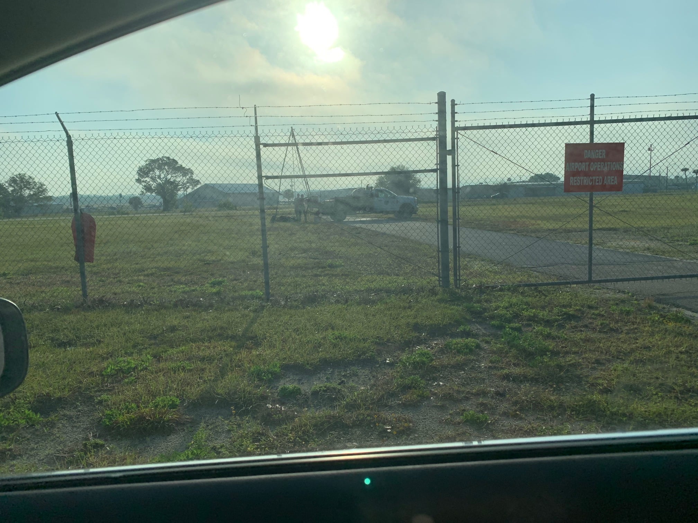

From David Cristol

Spring is upon us and we continue to make progress on the hangar project.  Some of you may have noticed activity on the land.  Our team has been out drilling holes, studying the soil, surveying the land and confirming the utilities.  As this work is completed reports are slowly rolling in and we continue to gain confidence in the viability of the project.

With the completion of a fresh survey we have refined our concept layouts and will be moving forward to present these to JAA once we have all of our data.  We also continue to research hangar and door vendors.  We received good feedback from some of you and appreciate the interest and comments.