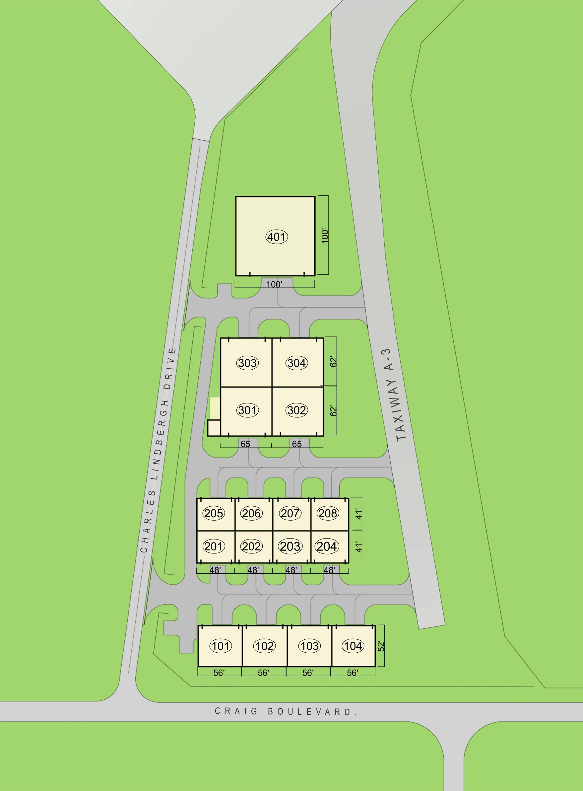

From David Cristol

Jacksonville Aircraft Owners and Pilot Association is pleased to announce more progress on realizing new hangars at Craig.  We are wrapping up our due diligence period and have learned a great deal about the land and the constraints involved.  I am sharing our current concept layout so that everyone can see the current plan.  The hangars will be conveniently located off A3 which provides for quick runway access.

The current design provides for three different size hangars.  Please note the hangar sizes shown are approximate and will likely vary as we source the actual buildings.  All hangars will be box type with bifold doors.  There will be 8 small hangars which will be 48’ wide by 41’ deep.  There are 4 medium hangars which will be 56’ wide by 52’ deep.  There are 4 large hangars which will be 65’ wide by 62’ deep.  Additionally there is one very large hangar which has already been allocated.

We have emphasized having hangars that have wide doors to accommodate the current generation of aircraft.  We also have designed 79’ wide taxi lanes to increase safety and make maneuvering easier.  The design also incorporates an air conditioned common space with bathrooms.  We are finalizing the hangar designs but expect to have modern bi fold doors as well as other features consistent with modern high quality hangars.

We have submitted this concept to JAA.  In the next few months we will begin taking reservations for specific hangar units.  We plan to take reservations on a first come first serve basis.  Reservations will require a small refundable deposit which will hold your choice of hangar.  We want the process to be as transparent as possible and will provide details as to how to participate in advance of the reservation process.

In our next updates we hope to be able to provide an estimate of the hangar costs, timing and more details about the hangars.  We do understand that some people wish to have the ability to finance a unit and we are working towards providing these options as well.

As always I am available to answer any questions you may have.  We appreciate everyone’s patience as we work through the many details to move this project forward.

