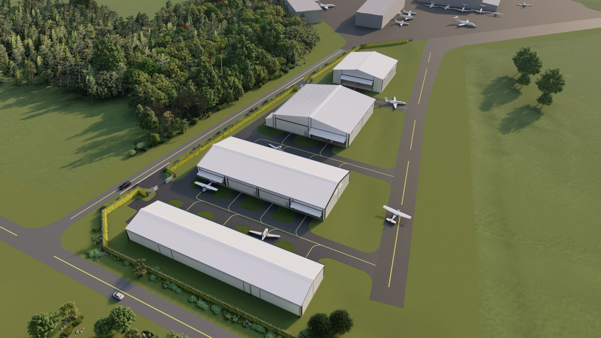

Thank you for your patience, our journey to build new hangars at Craig has been longer than we hoped but we continue to move forward. The last few months have been devoted to further developing the project and working with JAA to negotiate a lease for the land.  We believe we are in the final stages of realizing the lease.  Once we have a lease we will begin taking reservations for hangars.

If you are still interested in purchasing a hangar, we would like to talk to you to understand your specific needs. Please reply with a phone number where you may be reached.  If you want us to call during a certain time period, please let us know as well.  We will reach out to you to discuss the project and answer any questions we can.

Again if you are interested, be sure to reply and talk to us as this will assure that you are notified when the hangars are available and we begin the reservation process.

