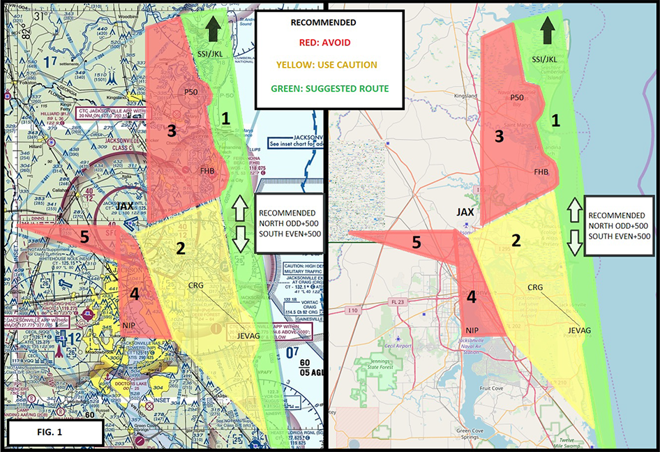
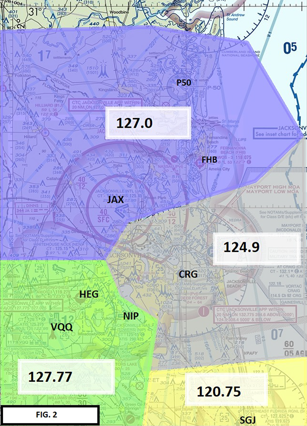

Brad Martin from Jaxex just forwarded us the following recommendations on flying through are local airspace.

##### Issued: 07/31/2019 1821 (UTC) 
##### Jacksonville Tower
##### Effective: 08/05/2019 1200 (UTC) 
##### Letter to Airmen: LTA-JAX-9

##### Subject: Recommended VFR Routes within JAX Approach Airspace 
##### Cancellation: 08/05/2021 1200 (UTC)

## GENERAL:

Congested airspace and hot spots, or areas of frequent conflict, have been identified within the confines of
Jacksonville (JAX) approach control. Suggested routes for VFR arrivals, departures, and overflights within JAX
airspace are outlined. It is also recommended that areas of frequent congestion (also defined in “Figure 1”) are
avoided when not in direct communication with air traffic control (ATC).

1) **Atlantic coast, from St.Augustine (SGJ), to the Brunswick/Jekyll Island (SSI/JKL) area North of
Jacksonville approach:**

    A) Using the coastline to navigate North/South is preferred. JAX arrivals from the North, East, and South are
naturally de-conflicted from this area.
    B) Due to the North-South flow of traffic in Florida, IFR aircraft exchanged between approach control and
center sectors typically do not comply with the standard North/East-bound “odd” and South/West-bound “even”
altitudes. It is recommended that VFR aircraft along the coast (depicted in Area 1) maintain an ODD altitude plus
500 feet Northbound, and an EVEN altitude plus 500 feet Southbound while in JAX approach control airspace.
    C) Prohibited Area 50 (P50) should be avoided below 3,000MSL. Overflights around Fernandina Beach airport
(FHB) passing East of the airport are in a better position, as skydiving aircraft typically climb to the West of the
field. The final approach course for RWY32 at CRG (See: JEVAG) is heavily congested with flight training.
    D) It is suggested that, at a minimum, aircraft monitor the frequencies depicted in “Figure 2.”

2) **Eastern Nassau, Duval, and St. John’s counties from St.Augustine to Fernandina Beach:**

    A) High density pilot training. Aircraft can contact JAX approach on 124.9 or 132.77 in the vicinity of CRG, and
120.75 just North of St.Augustine. It is suggested that aircraft avoid loitering over the extended finals for RWY 32
at CRG and RWY 13 at SGJ when not in direct communication with JAX approach.
    B) It is recommended that CRG departures avoid turning into the NIP RWY 28 final.

3) **JAX RWY 26 Final, FHB, P50:**

    A) Southbound FHB departures are a conflict for JAX arrivals to RWY 26 (when JAX is on a West operation).
When practical, aircraft are advised to depart on a Southeast-bound heading and contact approach on 124.9.

    B) Northbound FHB departures use caution to avoid Prohibited Area 50. IFR departures, especially high-
performance aircraft, are encouraged to obtain an IFR release via the FHB GCO, or by dialing JAX approach at (904)741-0284.
    C) North/Southbound overflights are advised to avoid this area when not in direct communication with ATC due
to the high volume of jet aircraft arriving/departing JAX.

4) **NAS Jacksonville RWY 28 final, JAX international departure corridor:**

    A) The RWY 28 final at NIP is congested with extensive jet aircraft performing training.
    B) Departures from JAX International are often climbing Southwest or Southeast-bound. It is advised that these
departure corridors should be avoided.

5) **JAX international RWY 8 final:**

    A) It is recommended that aircraft avoid the extended final for RWY 8 at JAX International, and be aware of the
high volume of flight training at NEN, VQQ, and HEG, as well as skydiving / glider activity.

Figure 1

