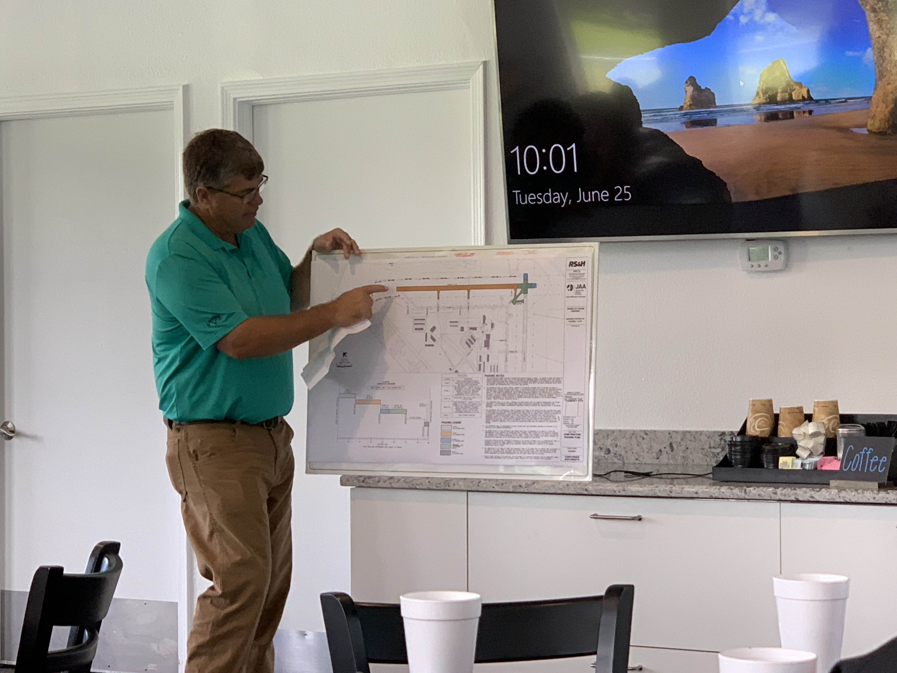

The Jacksonville Airport Authority had a tenants meeting today to go over some of the recent changes at Craig. The runway resurfacing for 32-14 is now complete as you may have noticed. 
In addition to the runway being resurfaced, some of the taxiways have been widened and the blast pads extended. New LED lighting was installed as well as part of the airport upgrades.

Runway resurfacing needs to occur about every 15-20 years. Runway 5-23 is not scheduled to be resurfaced for another six years. 
They also discussed improving the signage around the aircraft wash, and they wanted to let everyone know it is working.

### The badging office hours
The badging office hours will be changing to Tuesday and Thursday from 11 AM to 1 PM. Please feel free to contact Brad Martin at the airport authority about scheduling around badges. They are also working on a system for alerting us when our badge is about to expire.

