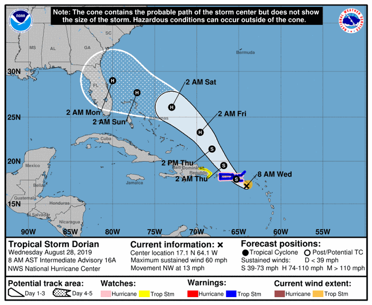

### From Brad Martin;

All,

Dorian is expected to impact our area late Sunday or early Monday morning.  JAXEX will make available Hangar 607 for aircraft on a first come basis Friday at 8am till 5pm.  Please only use this option with the understanding that Tuesday morning would be the earliest the Hangar would reopen.  Also those wanting to use the hangar will need to have the owner or an authorized representative sign a Hold Harmless agreement (attached) prior to placing aircraft in hangar.  Please note type of aircraft and tail number at the bottom of the [hold harmless form](/JAA General Hold Harmless.pdf).  You can scan the form back to me via email or bring the form by the office, you can slide under the door if no one is in.

Thanks,

Brad Martin ACE

